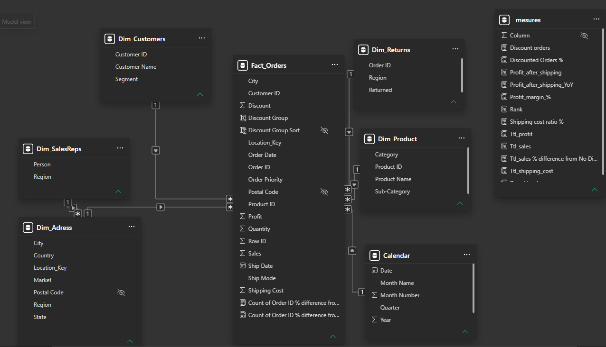
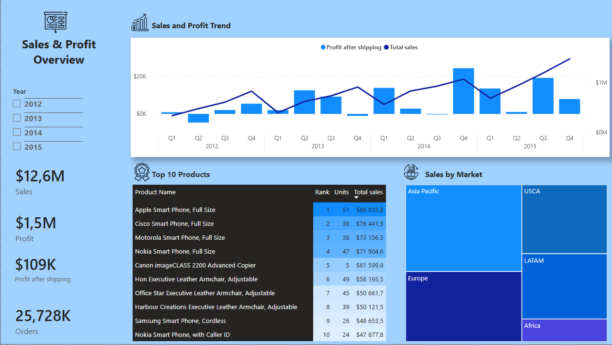
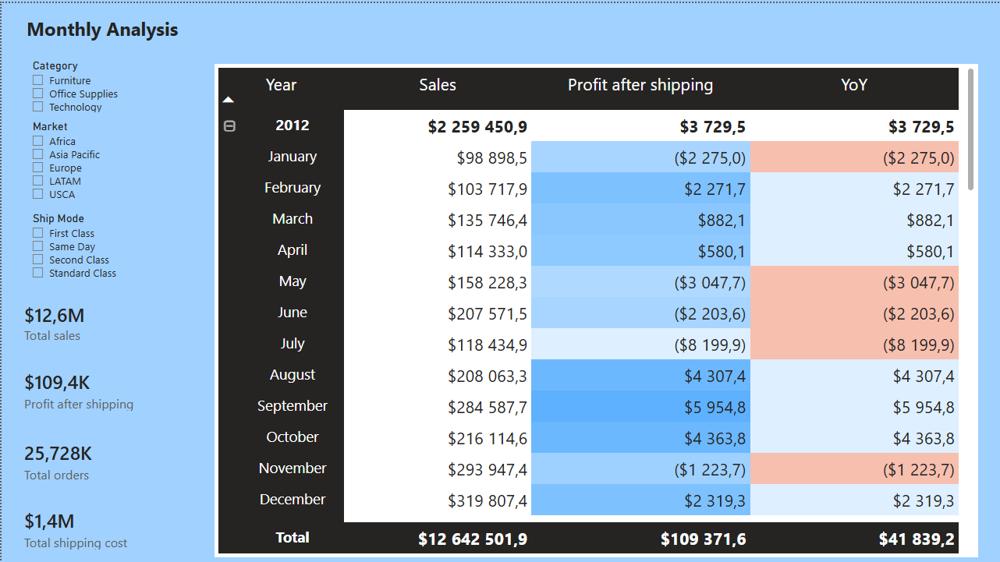
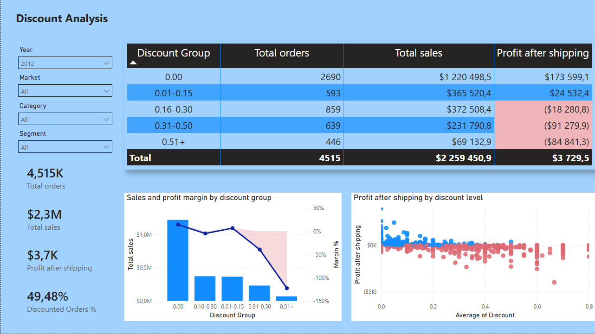
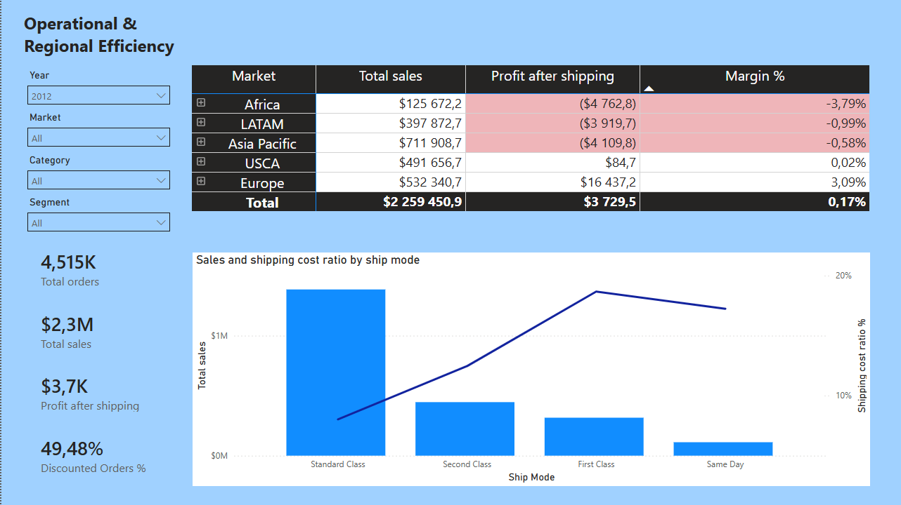
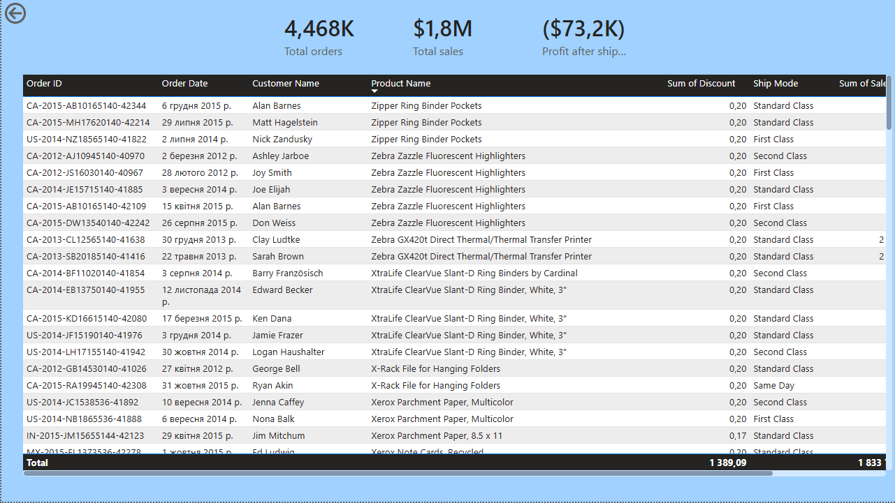

# Executive Sales & Logistics Optimization Dashboard (Power BI Case Study)

## 📌 Business Overview & Challenge
A large multinational distributor operating in the US and global markets faced stagnant net profit growth despite generating millions in revenue. The goal of this project was to clean raw transactional data, build a resilient data model using a Star Schema architecture, and design an interactive multi-page Power BI dashboard to diagnose leaks in operational profitability.

## 🛠️ Tech Stack & Skills Demonstrated
* **Data Modeling:** Star Schema design, custom surrogate keys creation (`Location_Key` via `[Postal Code] & "-" & [City]`) to resolve disconnected dimensions.
* **ETL (Power Query):** M-code column transformations, handling null text values, and proper table formatting.
* **DAX (Data Analysis Expressions):** Strict, clean corporate naming convention (e.g., `Total sales`, `Profit after shipping`, `Profit_margin_%`). Time-intelligence mechanisms (YoY comparisons) and advanced filtering isolation.
* **UI/UX & Business Storytelling:** Clean layout with a persistent navigation side-menu, synchronized data filtering, and conditional formatting tailored to highlight business risks.

## 📐 Data Modeling & Architecture
To ensure high performance, scalar query speed, and strict data integrity, the relationship architecture was designed using a classic **Star Schema** approach.

* **Fact Table:** `Fact_Orders` containing high-granularity transactional metrics (Sales, Profit, Quantity, Shipping costs).
* **Dimension Tables:** `Dim_Customers`, `Dim_Products`, `Dim_Adress` (Geography Data), `Dim_SalesReps` (Managers), and a custom auto-generated `Dim_Calendar` for time-intelligence reporting.
* **Bridge Relations:** Implemented a single-direction filter transit routing from `Dim_SalesReps` ➡️ `Dim_Adress` via `Region` parameters to isolate local sales manager metrics without data duplication.

## 📊 Dashboard Architecture & Insights

### Page 1. Executive overview
* **Core Elements:** C-level summary KPI cards (`Total sales`, `Orders`), Sales and profit trend (Line and stacked column chart using dynamic twin Y-axes), and Top 10 products ranking with native DAX dense ranking.
* **Key Insight:** Successfully handled multi-scale data parsing by cleanly isolating top-level revenue patterns from strict profit trends on a unified trend chart.

### Page 2. Monthly analysis
* **Core Elements:** Deep-dive financial Matrix grid (Years ➡️ Months) augmented with conditional Data Bars.
* **Key Insight:** Implemented `IF(ISINSCOPE(...))` filtering to automatically hide deceptive YoY anomalies on the initial periods where historical comparison data was unavailable.

### Page 3. Discount analysis (The Profit Leaks)
* **Core Elements:** Corporate group-sorted Matrix (`No Discount` serving as a baseline at index 0), Sales and profit margin by discount group (Combo chart), and a granular transaction-level Scatter plot.
* **Key Insight:** Designed a custom DAX error band (`Zero_Line_Loss`) that dynamically highlights structural losses in a warning shade *only* when the margin drops below 0%. This visually proves to management that discount tiers exceeding 16-20% completely destroy company net profit.

### Page 4. Operational efficiency
* **Core Elements:** Matrix mapped with regional hierarchy (`Market` ➡️ `Region` ➡️ `Person`) connected via a transited bridge relation (`Dim_SalesReps` ➡️ `Dim_Adress` ➡️ `Fact_Orders`).
* **Key Insight:** Uncovered that massive sales regions like APAC and LATAM are running in a net deficit. The combination chart exposes that urgent fulfillment via `First Class` shipping drives logistical expenses up to 17-18% of revenue, completely devouring the business margin.

### Page 5. Hidden detail page with orders (Technical Audit)
* **Core Elements:** End-to-end technical table with row-level transaction auditing (Order ID, Product Name, exact Discount, Ship Mode).
* **Key Insight:** Hidden from default view and strictly accessible via native `Drill-through` filtering from analytical dashboards to prevent clutter while allowing deep operational deep-dives.

---
*Developed as part of a professional Freelance Data Analytics Portfolio.*
